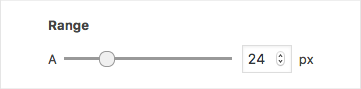
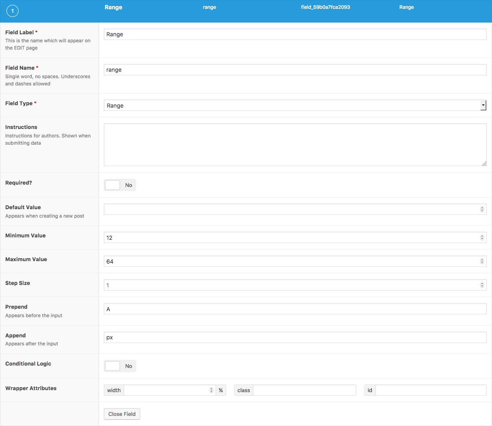

# Range

### Screenshots {#screenshots}





### Settings {#settings}

| Name | **Description** |
| --- | --- | --- | --- | --- | --- | --- |
| Default Value | The default value loaded when editing a new post \(when no value exists\) |
| Minimum Value | The minimum \(numeric\) value allowed, which must not be greater than its maximum value. Defaults to 0 |
| Maximum Value | The maximum \(numeric\) value allowed, which must not be less than its minimum value. Defaults to 100 |
| Step Size | The increment at which a numeric value can be set. Defaults to 1 |
| Prepend | HTML displayed before \(to the left\) of the range input |
| Append | HTML displayed after \(to the right\) of the range input |

### Template usage {#template-usage}

The **Range** field will return a numeric value. Below are some examples of how you can use this data. Please note that all following examples use a Range field called “font\_size”, and if you are working with a sub field, remember to replace any `get_field()` and `the_field()` functions with the relative `get_sub_field()` and `the_sub_field()` functions.

#### Basic

This example shows how to use the selected value as a ‘font-size’ style for all `<h2>` elements.

```php
<?php 

// vars
$font_size = get_field('font_size');

?>
<style type="text/css">
<?php if( $font_size ): ?>
	h2 {
		font-size: <?php echo $font_size; ?>px;
	}
<?php endif; ?>
</style>
```



[Lien vers la documentation ACF &gt; Field Types &gt; Range](https://www.advancedcustomfields.com/resources/range/)


