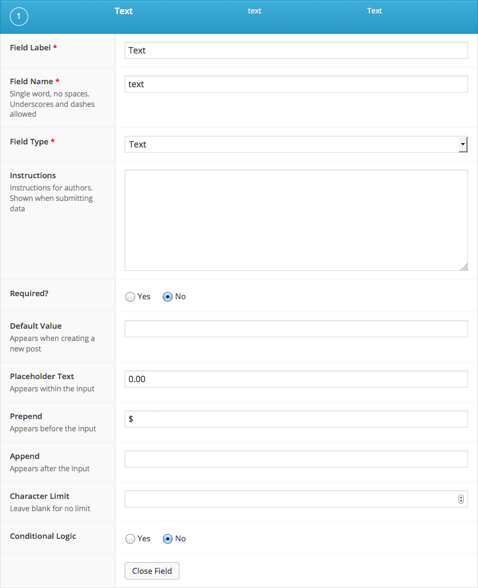

# Text

### Captures d'écran {#screenshots}




### Settings

| **Name** | **Description** |
| :--- | :--- |
| **Default value** | Set a default value for this field when creating a new post |
| **Placeholder** | Appears within input when no value exists |
| **Prepend** | Adds visual text element before the input  |
| **Append** | Adds a visual text element after the input |
| **Character Limit** | Limits the number of characters allowed |

### Template usage {#template-usage}

The API will return a string.

```php
<h2><?php the_field('text'); ?></h2>
```



[Lien vers la documentation ACF &gt; Field Types &gt; Text](https://www.advancedcustomfields.com/resources/text/)



