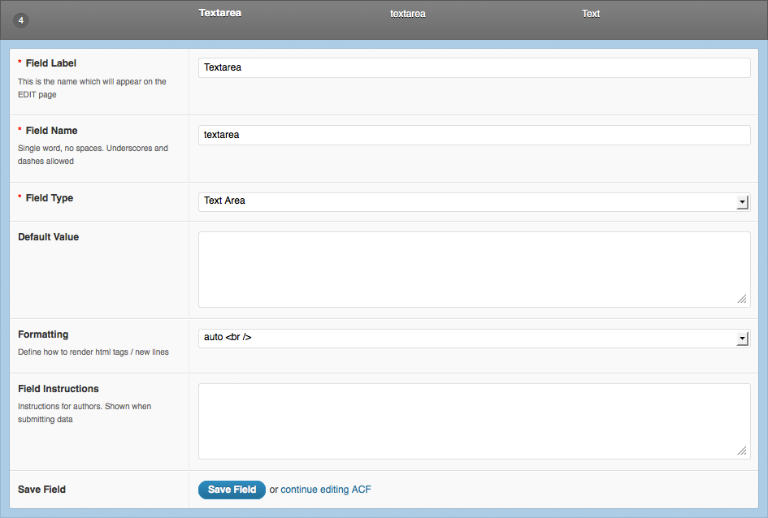
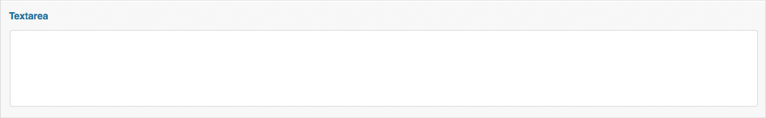

# Textarea

### Creating a textarea <a id="creating-a textarea"></a>

The Textarea field contains options to customize your field:

* **Default Value**: Set a default value for this field when creating a new post.
* **Formatting**: This option will determine how to render the value. Selecting “HTML” will convert any tags in the value to html tags. Selecting “auto &lt;br /&gt;” will convert any new lines to html line breaks. Selecting “None” will not convert any tags and you will see any html displayed as normal text.



### Edit Screen <a id="edit-screen"></a>



### Template usage <a id="template-usage"></a>

The API will return a string.

```php
<p><?php the_field('textarea'); ?></p>
```



[Lien vers la documentation ACF &gt; Field Types &gt; Textarea](https://www.advancedcustomfields.com/resources/textarea/)


